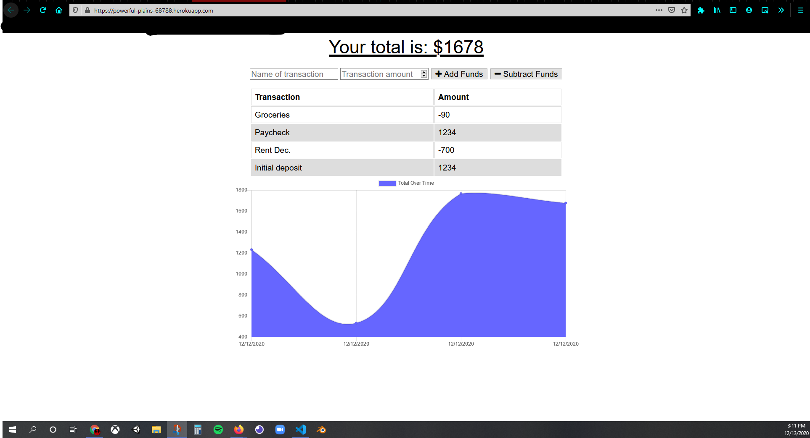

# Budget Tracker
  An app to help track expenses and income
## Features
  * This app is a PWA
  * Allows on, and offline functionality
  * A user can enter a name of a transaction
  * The user can decide the ammount for the transaction
  * The user can Add or subtract that ammount from their total
  
## Screenshot

## Languages
 * JavaScript
 * HTML
 * CSS
  ### Packages
  * Compression - Middleware
  * Express.js
  * Mongoose
  * Morgan
  
## Contributors
  Josh Miller
  
  
  Xander Rapstine (author)
